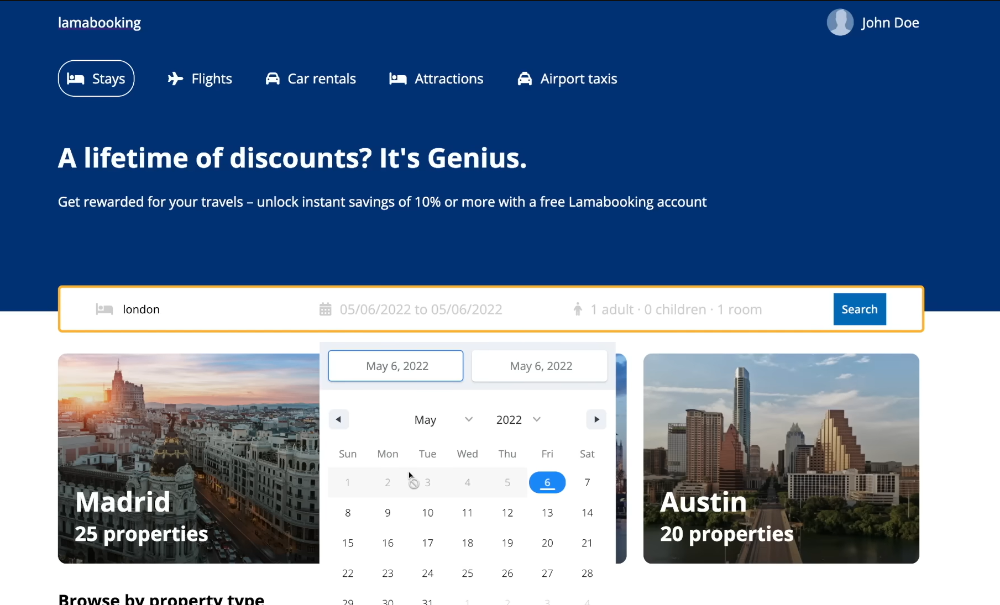

# BookingApp

## Target Goal



A simple hotel booking application built with Node.js, Express, and MongoDB.

## Prerequisites

- Node.js (v14 or higher)
- MongoDB

## Installation

1. Clone or download this repository

2. Install dependencies:
   ```bash
   npm install
   ```

3. Create a `.env` file in the root directory and add your MongoDB connection string:
   ```
   MONGO=your_mongodb_connection_string
   ```

## Running the Server

### Development Mode (with auto-restart)
```bash
npm run dev
```

### Production Mode
```bash
npm start
```

The server will start on `http://localhost:8800`

## Project Structure

```
BookingApp/
├── routes/
│   ├── auth.js      # Authentication routes
│   ├── hotels.js    # Hotel management routes
│   ├── rooms.js     # Room management routes
│   └── users.js     # User management routes
├── index.js         # Main server file
├── package.json     # Dependencies and scripts
└── .env            # Environment variables (create this)
```

## Available Endpoints

- `GET /auth/` - Authentication endpoint

## Technologies Used

- **Express** - Web framework
- **MongoDB** - Database
- **Mongoose** - MongoDB object modeling
- **dotenv** - Environment variable management
